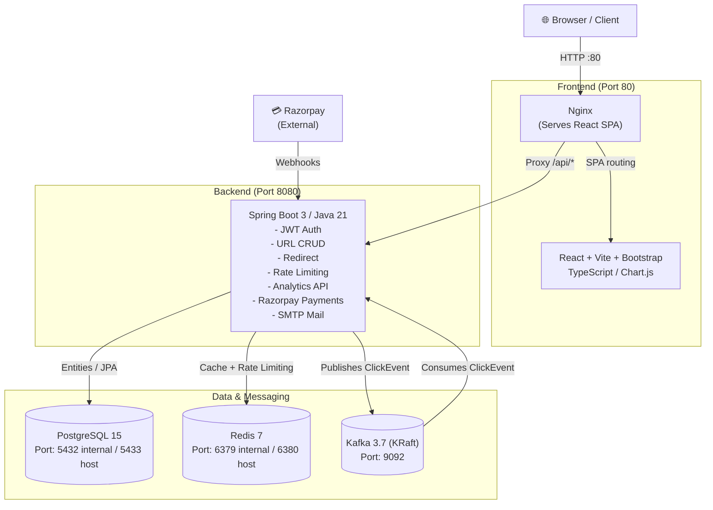

<h1 align="center">URL Shortener</h1>

<p align="center">
  
  
  
  
  
  
  
  
  
  
  
  
  <!--  -->
  
  <!--  -->
  <!--  -->
</p>

<p align="center">A production-grade URL Shortener monolith designed for speed, security, and scalability.</p>

---

## Highlights

🔗 Shorten long URLs with unique Base62 short codes.

✏️ Create custom aliases for eligible users.

⏳ Set URL expiration times.

🔐 Secure authentication using JWT + HttpOnly refresh cookies.

📧 Forgot-password and email reset flow.

⚡ Redis caching and API rate limiting.

📊 Kafka-based asynchronous click analytics.

💳 Razorpay Test Mode subscription support.

🌙 Dark / Light theme.

📈 Analytics dashboard with Chart.js.

🐳 Dockerized deployment with Nginx.

---

## Architecture



---

## Features

| Feature | Description |
|---|---|
| **Base62 URL Shortening** | Unique 7-char short codes generated from database IDs |
| **Custom Short Codes** | PRO plan users can specify a custom alias |
| **Link Expiry** | Links can be set to expire at a specific timestamp |
| **JWT Auth** | Access tokens stored **in memory only** (Zustand), refresh tokens via HttpOnly cookies |
| **Forgot Password & Email** | Real email password reset flow via Spring Boot Mail / SMTP |
| **Dark / Light Theme** | Production-quality dark and light mode system using CSS variables and React Context |
| **Redis URL Cache** | Redirects check Redis first to minimize database load |
| **Redis Rate Limiting** | Sliding-window Lua-script rate limiter enforced per IP/endpoint |
| **Kafka Analytics** | Click events published asynchronously to Kafka; persisted via consumer |
| **Analytics API** | Device, browser, OS, referrer, and click-timeline breakdowns |
| **Razorpay PRO** | ₹499/30-day subscription activated via server-side signature verification |
| **React Frontend** | Responsive SaaS UI with Bootstrap, Lucide icons, and Chart.js dashboards |

---

## Project Structure

```
URL Shortener/
├── backend/                 # Spring Boot monolith (Java 21)
│   ├── src/main/java/...
│   ├── src/test/java/...
│   ├── src/main/resources/
│   │   ├── application.yml
│   │   ├── application-dev.yml
│   │   └── db/migration/    # Flyway V1–V3 SQL migrations
│   ├── pom.xml
│   └── Dockerfile
├── frontend/                # React + Vite + TypeScript + Bootstrap
│   ├── src/
│   │   ├── pages/           # LandingPage, Login, Register, Dashboard, Analytics, Upgrade
│   │   ├── components/      # Sidebar, PrivateRoute
│   │   ├── store/           # Zustand authStore
│   │   └── lib/             # Axios interceptor (401 refresh queue)
│   ├── nginx.conf
│   └── Dockerfile
├── environment/
│   ├── .env                 # Local Docker secrets (git-ignored)
│   └── .env.example         # Template for secrets
├── .github/
│   └── workflows/ci.yml     # GitHub Actions CI pipeline
├── docker-compose.yml
├── verify-project.sh        # Bash verification script
├── verify-project.bat       # Windows CMD verification script
└── README.md
```

---

## Getting Started

Prerequisites

- Java 21
- Maven 3.9+
- Node.js 20+
- Docker Desktop

1. Start Infrastructure

```
docker compose up -d postgres redis kafka
```

2. Start Backend

```
cd backend
mvn spring-boot:run
```

Backend:

http://localhost:8080

3. Start Frontend

```
cd frontend
npm install
npm run dev
```

Frontend:

http://localhost:5173

Configuration

Create the local environment file:

```
cp environment/.env.example environment/.env
```

Configure the required values:

```
JWT_SECRET=<your-secret>

RAZORPAY_KEY_ID=rzp_test_...
RAZORPAY_KEY_SECRET=<your-secret>
RAZORPAY_WEBHOOK_SECRET=<your-secret>
```

---

## Production

Build and start all services:

```
docker compose up --build -d
```

Application:

http://localhost

Check services:

```
docker compose ps
```

Stop services:

```
docker compose down
```

---

## 📄 License

MIT

---
