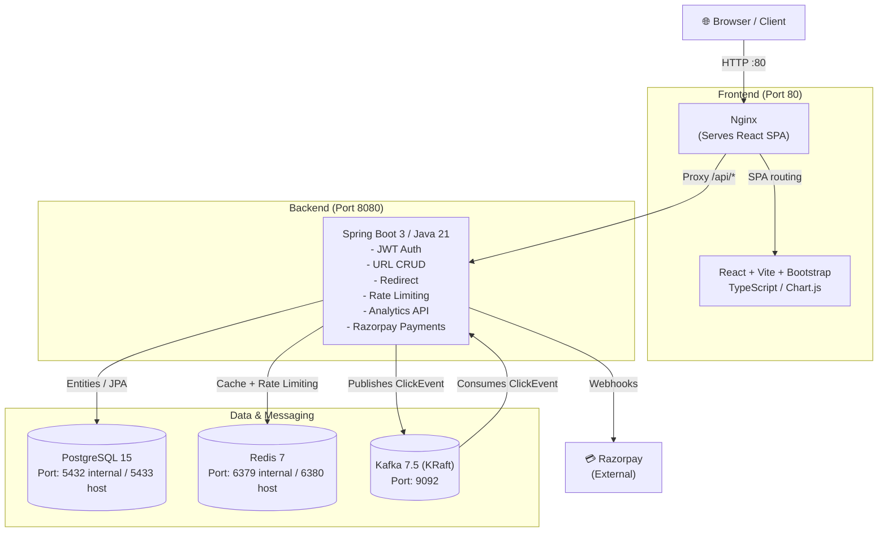

# URL Shortener SaaS

<p align="left">
  
  
  
  
  
  
  
  
  
  
</p>

A production-grade **URL Shortener SaaS monolith** designed for speed, security, and scalability.

---

## Architecture



---

## Features

| Feature | Description |
|---|---|
| **Base62 URL Shortening** | Unique 7-char short codes generated from database IDs |
| **Custom Short Codes** | PRO plan users can specify a custom alias |
| **Link Expiry** | Links can be set to expire at a specific timestamp |
| **JWT Auth** | Access tokens stored **in memory only** (Zustand), refresh tokens via HttpOnly cookies |
| **Redis URL Cache** | Redirects check Redis first to minimize database load |
| **Redis Rate Limiting** | Sliding-window Lua-script rate limiter enforced per IP/endpoint |
| **Kafka Analytics** | Click events published asynchronously to Kafka; persisted via consumer |
| **Analytics API** | Device, browser, OS, referrer, and click-timeline breakdowns |
| **Razorpay PRO** | ₹499/30-day subscription activated via server-side signature verification |
| **React Frontend** | Responsive SaaS UI with Bootstrap and Chart.js dashboards |

---

## Project Structure

```
URL Shortener/
├── backend/                 # Spring Boot monolith (Java 21)
│   ├── src/main/java/...
│   ├── src/test/java/...
│   ├── src/main/resources/
│   │   ├── application.yml
│   │   ├── application-dev.yml
│   │   └── db/migration/    # Flyway V1–V3 SQL migrations
│   ├── pom.xml
│   └── Dockerfile
├── frontend/                # React + Vite + TypeScript + Bootstrap
│   ├── src/
│   │   ├── pages/           # LandingPage, Login, Register, Dashboard, Analytics, Upgrade
│   │   ├── components/      # Sidebar, PrivateRoute
│   │   ├── store/           # Zustand authStore
│   │   └── lib/             # Axios interceptor (401 refresh queue)
│   ├── nginx.conf
│   └── Dockerfile
├── environment/
│   ├── .env                 # Local Docker secrets (git-ignored)
│   └── .env.example         # Template for secrets
├── .github/
│   └── workflows/ci.yml     # GitHub Actions CI pipeline
├── docker-compose.yml
├── verify-project.sh        # Bash verification script
├── verify-project.bat       # Windows CMD verification script
└── README.md
```

---

## Local Development Setup

### Prerequisites
- Java 21 (JDK)
- Maven 3.9+
- Node.js 20+
- Docker Desktop

### 1. Start Infrastructure Services (Docker)

```bash
docker compose up -d postgres redis kafka
```

This starts:
- PostgreSQL on port `5433`
- Redis on port `6380`
- Kafka on port `9092`

### 2. Configure Local Application Settings

The following files are **git-ignored** and must exist locally:

- `backend/src/main/resources/application.yml`
- `backend/src/main/resources/application-dev.yml`

Copy from `backend/.gitignore` — see comments in file for structure.

### 3. Start Backend

```bash
cd backend
mvn spring-boot:run
```

Backend runs on: **http://localhost:8080**

### 4. Start Frontend

```bash
cd frontend
npm install
npm run dev
```

Frontend runs on: **http://localhost:5173**

> The Vite dev proxy forwards all `/api` requests to `http://localhost:8080` automatically.

---

## Production Deployment (Docker Compose)

### 1. Configure Secrets

Copy the environment template and fill in real values:

```bash
cp environment/.env.example environment/.env
```

Edit `environment/.env`:

```env
JWT_SECRET=<your-256-bit-secret-key>
RAZORPAY_KEY_ID=rzp_test_...
RAZORPAY_KEY_SECRET=<your-razorpay-key-secret>
RAZORPAY_WEBHOOK_SECRET=<your-webhook-secret>
```

> ⚠️ Never commit real secrets. The `environment/.env` file is git-ignored at the root level.

### 2. Build and Start All Services

```bash
docker compose up --build -d
```

This starts 5 containers:
| Service | Port |
|---|---|
| Frontend (Nginx + React) | http://localhost **(:80)** |
| Backend (Spring Boot) | http://localhost:8080 |
| PostgreSQL | localhost:5433 |
| Redis | localhost:6380 |
| Kafka | localhost:9092 |

### 3. Access the Application

- **Frontend:** http://localhost/
- **Backend API:** http://localhost:8080/api/
- **Swagger UI:** http://localhost:8080/swagger-ui.html
- **OpenAPI JSON:** http://localhost:8080/v3/api-docs

---

## Running Tests

### Backend Tests (45 unit + integration tests)

```bash
cd backend
mvn clean test
```

Test suites include:
- `UrlServiceTest` — Base62 encoding, collision handling, FREE plan limits, expiry rules
- `RedirectControllerTest` — Redis cache HIT/MISS, expired/disabled link validation
- `RedisRateLimiterServiceTest` — Sliding window rate limiter
- `ClickEventConsumerTest` — Kafka consumer idempotency, duplicate detection, link-not-found handling
- `PaymentServiceTest` — Order creation, signature verification, webhook dispatch
- `PaymentActivationServiceTest` — PRO activation, subscription upsert, idempotency

### Frontend Lint + Build

```bash
cd frontend
npm ci
npm run lint      # Oxlint static analysis
npm run build     # TypeScript compile + Vite production bundle
```

### Verify Full Project (Windows)

```batch
verify-project.bat
```


